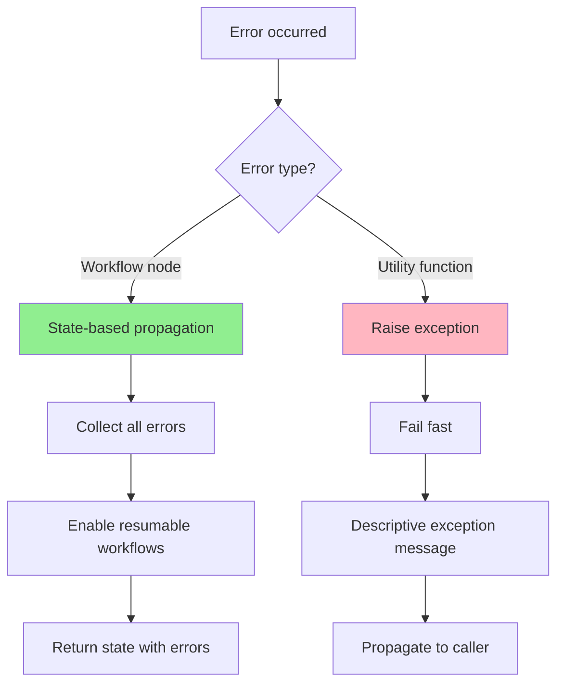
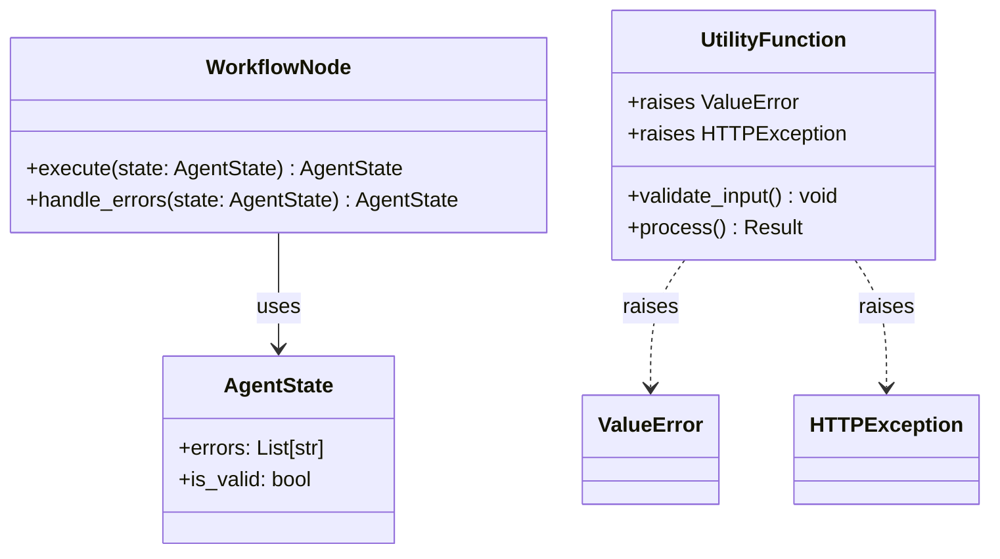
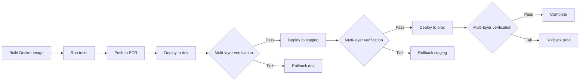
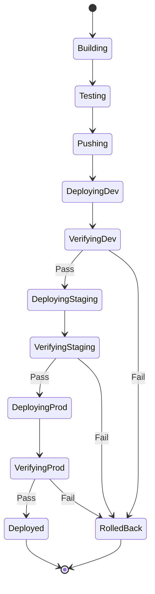
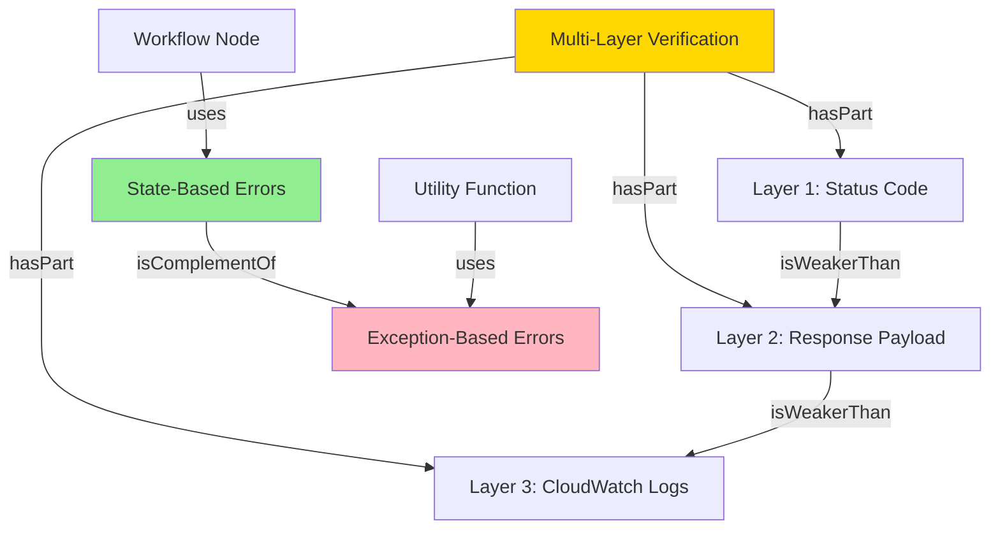

# Consolidate Command

**Purpose**: Gather → Understand → Consolidate (Tactical + Strategic) → Save + Communicate

**Four-phase process**:
1. **Gather**: Collect information from multiple sources
2. **Understand**: Build mental model from gathered data
3. **Consolidate**: Create dual-layer understanding
   - **Tactical**: Resolve contradictions, fill gaps, unify model
   - **Strategic**: Extract reusable patterns (always)
4. **Communicate**: Save to `.claude/consolidate/{date}-{slug}.md` + print to stdout

**Output persistence**: All consolidations automatically saved for future reference

**Pattern extraction**: Always extracts strategic patterns (no flag needed)

---

## Execution Flow

### Phase 1: Gather Information

Search for information about topic:
- Code files
- Documentation
- Observations
- Journals
- Abstractions

### Phase 2: Understand

Build mental model from gathered information:
- Identify patterns
- Map relationships
- Understand mechanisms

### Phase 3: Consolidate (Dual-Layer - Always Extract, Conditionally Display)

**Tactical Layer** (understanding):
- Resolve contradictions (reconcile conflicting information)
- Fill gaps (identify missing pieces)
- Unify understanding (coherent whole)

**Strategic Layer** (pattern extraction - always execute, conditionally display):
- Always attempt pattern extraction
- Extract reusable patterns from consolidated knowledge
- Identify pattern structure and intent
- Provide concrete examples
- Note when to apply patterns
- **If patterns found**: Include Strategic Patterns section in output
- **If no patterns found**: Omit Strategic Patterns section entirely (no message needed)

### Phase 4: Communicate (Dual Output)

**4a. Save to file** (persistence):
- Generate filename: `.claude/consolidate/{date}-{slug}.md`
- Include frontmatter metadata (title, date, topic_slug)
- Save both tactical understanding and strategic patterns
- Inline diagrams (if `--diagrams` flag used)

**4b. Print to stdout** (immediate visibility):
- Display complete consolidation to user
- Show file path where saved
- Example: "💾 Saved: .claude/consolidate/2025-12-30-error-handling-patterns.md"

---

## Output Format

**File location**: `.claude/consolidate/{date}-{slug}.md`

**Example**: `.claude/consolidate/2025-12-30-error-handling-patterns.md`

```markdown
---
title: {topic}
date: {ISO 8601 timestamp}
topic_slug: {slug}
generated_by: /consolidate
---

# Consolidated Knowledge: {topic}

## Information Sources

- **Source 1**: {file path or reference}
  - Relevant: {what information was useful}
- **Source 2**: {file path or reference}
  - Relevant: {what information was useful}
- **Source 3**: {file path or reference}
  - Relevant: {what information was useful}

---

## Tactical Understanding

**What We Learned**:

### Core Concept
{What this topic is about}

### Key Components
1. **Component 1**: {Description}
2. **Component 2**: {Description}
3. **Component 3**: {Description}

### How It Works
{Mechanisms, relationships, processes}

### Contradictions Resolved
- **Contradiction 1**: {What conflicted}
  - Resolution: {How reconciled}
  - Source: {Where contradiction found}

### Gaps Identified
- **Gap 1**: {What's missing}
  - Evidence: {Why we think this is a gap}
  - Next step: {How to fill this gap}

### Key Insights
- ✅ {Insight 1}
- ✅ {Insight 2}
- ✅ {Insight 3}

### Open Questions
- [ ] {Question 1 still unanswered}
- [ ] {Question 2 needs investigation}

---

## Strategic Patterns

**Reusable Abstractions** (applicable beyond this specific topic):

### Pattern 1: {Pattern Name}

**Intent**: {What problem does this pattern solve}

**When to Use**:
- Scenario 1: {Specific condition when pattern applies}
- Scenario 2: {Another condition}

**Structure**:
\`\`\`
{Template or skeleton showing pattern structure}
\`\`\`

**Concrete Example**:
\`\`\`{language}
{Code or configuration example from sources}
\`\`\`

**Related Patterns**:
- {Pattern X}: {Relationship - complements, substitutes, etc.}

---

### Pattern 2: {Pattern Name}

[Same structure as Pattern 1]

---

**Note**: The Strategic Patterns section only appears when patterns are found.
When no reusable patterns exist, this entire section is omitted from the output.

---

## Diagrams (if --diagrams flag used)

### Diagram 1: {Diagram Type}

**Purpose**: {What this diagram shows}

\`\`\`mermaid
{Mermaid markup}
\`\`\`

---

### Diagram 2: {Diagram Type}

**Purpose**: {What this diagram shows}

\`\`\`mermaid
{Mermaid markup}
\`\`\`

---

## Metadata

**Generated**: {ISO 8601 timestamp}
**Topic**: {original topic string}
**Slug**: {filename slug}
**Sources**: {count} files/references
**Patterns Extracted**: {count} reusable patterns
**Diagrams**: {count} diagrams (if --diagrams used)

---

**💡 Tips**:
- Search all consolidations: `grep -r "pattern" .claude/consolidate/`
- Reference patterns: Link to this file from other docs
- Update patterns: Create new consolidation or edit existing file
```

---

## Examples

```bash
# Basic consolidation (tactical + strategic, auto-saved)
/consolidate "Lambda timeout behavior"
→ Gathers info from code, docs, observations
→ Creates tactical understanding (contradictions resolved, gaps identified)
→ Extracts strategic patterns (timeout configuration pattern)
→ Saves to: .claude/consolidate/2025-12-30-lambda-timeout-behavior.md
→ Prints to stdout for immediate viewing

# With diagrams (inline in saved file)
/consolidate "Error handling patterns" --diagrams
→ Tactical: State-based vs Exception-based patterns
→ Strategic: Extracts reusable patterns (Error Handling Duality)
→ Diagrams: Flowchart (decision tree) + Class Diagram (structure)
→ Saves to: .claude/consolidate/2025-12-30-error-handling-patterns.md

# Architecture analysis with visual diagrams
/consolidate "deployment workflow" --diagrams
→ Tactical: Build → Test → Deploy → Verify process
→ Strategic: Multi-environment deployment pattern
→ Diagrams: Flowchart + State Diagram + Timeline
→ Saves to: .claude/consolidate/2025-12-30-deployment-workflow.md

# Simple factual topic (no patterns)
/consolidate "Aurora MySQL version"
→ Tactical: Version information, compatibility notes
→ Strategic: "No reusable patterns identified (factual topic)"
→ Saves to: .claude/consolidate/2025-12-30-aurora-mysql-version.md
```

---

## Directory Structure and Persistence

### File Location

All consolidations are automatically saved to:
```
.claude/consolidate/{date}-{slug}.md
```

**Examples**:
- `.claude/consolidate/2025-12-30-error-handling-patterns.md`
- `.claude/consolidate/2025-12-30-deployment-verification.md`
- `.claude/consolidate/2025-12-31-progressive-evidence-strengthening.md`

### Directory Structure

```
.claude/consolidate/
├── README.md                                      # Index/guide
├── 2025-12-30-error-handling-patterns.md          # Consolidation 1
├── 2025-12-30-deployment-verification.md          # Consolidation 2
├── 2025-12-31-progressive-evidence-strengthening.md
├── 2025-12-31-caching-strategies.md
└── ... (grows over time)
```

### Finding Consolidations

**Search for patterns**:
```bash
grep -r "pattern name" .claude/consolidate/
```

**Find consolidations about topic**:
```bash
ls .claude/consolidate/ | grep "topic-keyword"
```

**List recent consolidations**:
```bash
ls -lt .claude/consolidate/ | head -10
```

**View consolidation**:
```bash
cat .claude/consolidate/2025-12-30-error-handling-patterns.md
```

### Benefits of Persistence

1. **Accumulate knowledge over time**: Build pattern library
2. **Reference in documentation**: Link to consolidations from other docs
3. **Search across all consolidations**: Find patterns easily with grep
4. **Version control**: Track evolution of understanding via git
5. **No decision overhead**: Always saved, no need to decide

---

## Relationship to `/summary`

`/summary` → `/consolidate` (alias)

`/consolidate` is the primary command:
- Full workflow: Gather + Understand + Consolidate (Tactical + Strategic) + Save
- Always persists to `.claude/consolidate/`
- Always extracts patterns

`/summary` is an alias (historically - now performs same as /consolidate)

---

## Prompt Template

You are executing the `/consolidate` command with arguments: $ARGUMENTS

**Topic**: $1
**Generate Diagrams**: $2 (--diagrams flag present: yes/no)

---

### Step 1: Gather Information (Research Phase)

Use the research skill to collect information about the topic from multiple sources:

**Search locations**:
1. **Code files**: Implementation details, examples
   ```bash
   grep -r "{topic}" src/ tests/
   ```

2. **Documentation**: Principles, guides, ADRs
   ```bash
   grep -r "{topic}" docs/ .claude/
   ```

3. **Observations**: Historical context, lessons learned
   ```bash
   grep -r "{topic}" .claude/observations/
   ```

4. **Journals**: Evolution, decisions, rationale
   ```bash
   grep -r "{topic}" .claude/journals/
   ```

5. **Skills**: Patterns, anti-patterns, workflows
   ```bash
   grep -r "{topic}" .claude/skills/
   ```

**Collect**:
- Direct information (what files say)
- Examples (code snippets, use cases)
- Context (why it exists, what problem it solves)

---

### Step 2: Understand (Analysis Phase)

Build mental model from gathered information:

**Identify patterns**:
- What recurring themes appear across sources?
- What common characteristics emerge?
- What principles underlie the implementations?

**Map relationships**:
- How do components connect?
- What dependencies exist?
- What interactions occur?

**Understand mechanisms**:
- How does it work internally?
- What are the key processes?
- What are the critical paths?

---

### Step 3: Consolidate (Synthesis Phase - Dual Layer)

Create both tactical understanding and strategic patterns (always both):

**Tactical Layer** (understanding):

**Resolve contradictions**:
- Identify conflicting information across sources
- Determine which is accurate (check code, test, verify)
- Explain why contradiction existed (outdated docs, misunderstanding)
- Document resolution

**Example**:
```
Contradiction: Docs say Lambda timeout is 30s, code has 60s
Resolution: Checked actual Lambda config → 60s is correct
Reason: Docs outdated from previous configuration
```

**Fill gaps**:
- Identify missing information
- Note what's unknown or unclear
- Suggest how to fill gaps (tests, investigation, documentation)

**Example**:
```
Gap: How does cache invalidation work?
Evidence: Code has cache writes, no cache deletes found
Next step: Search for TTL configuration or manual invalidation
```

**Unify understanding**:
- Combine all sources into coherent whole
- Create single mental model that explains all observations
- Ensure model is consistent and complete

---

**Strategic Layer** (pattern extraction - always execute, conditionally display):

**Extract reusable patterns**:
- Identify generalizable structures from consolidated knowledge
- Document pattern intent (what problem it solves)
- Specify when to use (scenarios, conditions)
- Provide concrete examples from sources
- Note related patterns

**If no patterns found**:
- Return empty patterns list (internal)
- Strategic Patterns section will be omitted from output
- No "No patterns identified" message needed
- This is normal for factual/procedural/configuration topics

---

### Step 4: Communicate (Presentation Phase - Dual Output)

Output consolidated knowledge in two ways:

**4a. Generate content** following the output format:

1. **Frontmatter metadata**: title, date, topic_slug, generated_by
2. **List sources**: Show where information came from (with relevance notes)
3. **Tactical Understanding section**:
   - Core concept, components, relationships
   - Contradictions resolved (what conflicted, how resolved)
   - Gaps identified (what's missing, how to fill)
   - Key insights (takeaways)
   - Open questions (needs investigation)
4. **Strategic Patterns section** (conditionally include):
   - If patterns extracted: Include Pattern 1, 2, 3... (intent, when to use, structure, example)
   - If no patterns: Omit this section entirely (do not include "No patterns" message)
5. **Diagrams section** (if --diagrams flag): Inline Mermaid diagrams
6. **Metadata section**: Generated timestamp, sources count, patterns count (if patterns exist)

**4b. Save to file**:
```python
date = datetime.now().strftime("%Y-%m-%d")
slug = slugify(topic)  # Convert to lowercase-with-dashes
filepath = f".claude/consolidate/{date}-{slug}.md"
write_file(filepath, output)
```

**4c. Print to stdout**:
```
[Print complete consolidation]

💾 Saved: .claude/consolidate/2025-12-30-error-handling-patterns.md
```

---

### Step 5: Generate Diagrams (Optional - if --diagrams flag present)

**Only execute this step if user provided --diagrams flag**

**Analyze topic characteristics**:
```python
# What type of content did we consolidate?
has_processes = contains_workflows_or_algorithms(consolidated_knowledge)
has_structures = contains_classes_or_schemas(consolidated_knowledge)
has_sequences = contains_time_based_interactions(consolidated_knowledge)
has_states = contains_state_transitions(consolidated_knowledge)
has_concepts = contains_hierarchical_concepts(consolidated_knowledge)
has_relationships = contains_semantic_relationships(consolidated_knowledge)
has_architecture = contains_system_layers(consolidated_knowledge)
```

**Select 1-3 most relevant diagram types**:

Use the smart diagram selection algorithm documented in "Visual Diagrams" section:
- **Process-heavy** → Flowchart, Sequence Diagram
- **Structure-heavy** → Class Diagram, ER Diagram, C4 Diagram
- **Concept-heavy** → Mindmap, OWL Ontology
- **State-heavy** → State Diagram, Timeline
- **Architecture-heavy** → C4 Diagram, Component Diagram

**Generate Mermaid diagrams**:

For each selected diagram type:
1. Create valid Mermaid syntax
2. Include relevant nodes/relationships from consolidated knowledge
3. Use colors/styling to highlight key concepts
4. Add clear labels and descriptions

**Explain each diagram**:
- **Why this diagram type was selected** (matches topic characteristics)
- **What this diagram shows** (specific insights visualized)
- **How it relates to principles** (if applicable, reference CLAUDE.md principles)

**Quality checks**:
- Limit to maximum 3 diagrams (cognitive load management)
- Each diagram must add unique value (no redundant information)
- Mermaid syntax must be valid (test mentally before outputting)
- Explanations must be specific (not generic "this shows the structure")

---

## Best Practices

### Do
- **Gather from multiple sources** (don't rely on single file)
- **Verify contradictions** (check code, test, measure)
- **Document gaps explicitly** (note what's unknown)
- **Synthesize into coherent model** (unified understanding)
- **Always extract patterns** (extraction always runs, section shows only if patterns exist)
- **Trust persistence** (all consolidations automatically saved)
- **Use descriptive topics** (helps with filename generation)
- **Accept pattern-free topics** (many factual/config topics have no patterns - that's normal)

### Don't
- **Don't ignore contradictions** (resolve or document)
- **Don't assume** (verify claims against reality)
- **Don't hide gaps** (acknowledge what's missing)
- **Don't skip synthesis** (just listing sources isn't consolidating)
- **Don't skip pattern extraction** (always execute strategic layer)
- **Don't expect patterns for all topics** (factual/procedural topics often have none)

---

## Visual Diagrams (--diagrams flag)

**Usage**: `/consolidate "topic" --diagrams`

**Purpose**: Auto-generate 1-3 Mermaid diagrams to visualize consolidated knowledge

**When to use**:
- Complex relationships need visualization
- Architecture or structure-heavy topics
- Process flows benefit from visual representation
- Concept hierarchies are easier to grasp visually

**When NOT to use**:
- Simple, linear topics (text is sufficient)
- Topics with minimal relationships
- Quick lookups (diagram generation overhead not worth it)

---

### Available Diagram Types (12+)

**Structural Diagrams** (relationships, hierarchies):
1. **Class Diagram**: Object-oriented relationships (inheritance, composition, association)
2. **Entity-Relationship Diagram**: Database schema, data models
3. **C4 Diagram**: Architecture layers (System → Container → Component → Code)
4. **Mindmap**: Concept hierarchies, topic breakdown
5. **OWL Ontology Diagram**: Formal semantic relationships (part-whole, complement, substitution, composition)

**Process Diagrams** (flows, sequences):
6. **Flowchart**: Decision trees, algorithms, workflows
7. **Sequence Diagram**: Interactions over time, API calls, message flows
8. **State Diagram**: State machines, lifecycle, transitions
9. **Timeline**: Chronological events, deployment history

**Data Visualization**:
10. **Pie Chart**: Proportions, distributions
11. **Gantt Chart**: Schedules, task dependencies

**Version Control**:
12. **Git Graph**: Branch strategies, commit history

---

### Smart Diagram Selection Algorithm

**Input**: Topic content (consolidated knowledge)

**Output**: 1-3 most relevant diagram types

**Selection logic**:

```python
# Analyze topic characteristics
characteristics = analyze_topic(consolidated_knowledge)

# Match characteristics to diagram types
if has_many_classes_or_objects(characteristics):
    diagrams.append("Class Diagram")

if has_database_schema(characteristics):
    diagrams.append("Entity-Relationship Diagram")

if has_process_or_workflow(characteristics):
    diagrams.append("Flowchart")

if has_time_based_interactions(characteristics):
    diagrams.append("Sequence Diagram")

if has_state_transitions(characteristics):
    diagrams.append("State Diagram")

if has_concept_hierarchy(characteristics):
    diagrams.append("Mindmap")

if has_architecture_layers(characteristics):
    diagrams.append("C4 Diagram")

if has_semantic_relationships(characteristics):
    diagrams.append("OWL Ontology Diagram")

# Limit to top 3 most relevant
return diagrams[:3]
```

**Examples**:

| Topic | Detected Characteristics | Diagrams Selected |
|-------|-------------------------|-------------------|
| "Error handling patterns" | Code patterns, decision flows | Flowchart, Class Diagram |
| "Multi-layer verification" | Process sequence, interactions | Sequence Diagram, Flowchart |
| "Deployment workflow" | Process + state changes | Flowchart, State Diagram, Timeline |
| "Aurora data architecture" | Database + architecture | ER Diagram, C4 Diagram |
| "Feedback loop types" | Concepts + relationships | Mindmap, OWL Ontology |
| "DynamoDB schema design" | Database structure | ER Diagram, Class Diagram |

---

### Output Format (with --diagrams)

```markdown
## Consolidated Knowledge: {topic}

### Information Sources
- Source 1: {file/doc}
- Source 2: {file/doc}

### Unified Model

**Core concept**: {What it is}

**Key components**:
1. {Component 1}: {Role}
2. {Component 2}: {Role}

**How they relate**: {Relationships}

---

### Visual Diagrams

**Diagram 1: {Type}** - {Why this diagram type was selected}

```mermaid
{Mermaid markup for diagram 1}
```

**What this shows**: {Explanation of diagram}

---

**Diagram 2: {Type}** - {Why this diagram type was selected}

```mermaid
{Mermaid markup for diagram 2}
```

**What this shows**: {Explanation of diagram}

---

### Contradictions Resolved
{...existing format...}

### Gaps Identified
{...existing format...}

### Key Insights
{...existing format...}

### Open Questions
{...existing format...}
```

---

### Example: /consolidate "error handling patterns" --diagrams

**Diagram 1: Flowchart** - Decision tree for choosing error handling pattern



**What this shows**: Decision tree for Error Handling Duality principle - workflow nodes use state-based error propagation (green), utility functions raise exceptions (pink)

---

**Diagram 2: Class Diagram** - Error handling class structure



**What this shows**: Class structure showing workflow nodes modify state (composition), utility functions raise exceptions (dependency)

---

### Example: /consolidate "deployment workflow" --diagrams

**Diagram 1: Flowchart** - Deployment process



**What this shows**: Deployment pipeline with multi-layer verification at each stage (Principle #6: Deployment Monitoring Discipline)

---

**Diagram 2: State Diagram** - Deployment states



**What this shows**: State machine for deployment lifecycle with explicit rollback states

---

**Diagram 3: Timeline** - Typical deployment duration

```mermaid
timeline
    title Deployment Timeline (dev branch)
    00:00 : Build starts
    02:30 : Tests complete
    03:00 : ECR push
    05:00 : Lambda update (dev)
    06:00 : Multi-layer verification
    08:00 : Deployment complete
```

**What this shows**: Time-based view showing ~8 min deployment to dev environment (from CLAUDE.md: "dev → dev environment (~8 min)")

---

### Diagram Generation Best Practices

**Do**:
- **Select diagrams that add value** (not just decoration)
- **Limit to 3 diagrams maximum** (cognitive load management)
- **Explain what each diagram shows** (don't assume self-explanatory)
- **Use colors/styling strategically** (highlight key concepts)
- **Match diagram type to content** (use smart selection algorithm)

**Don't**:
- **Don't generate diagrams for simple linear topics** (text is better)
- **Don't create identical information in multiple diagram types** (redundant)
- **Don't skip explanations** (diagrams need context)
- **Don't override smart selection without reason** (algorithm is tuned)

---

### Diagrams Persistence

**Inline diagrams** (generated with `--diagrams` flag):
- Auto-generated during consolidation
- Saved inline in consolidation file (`.claude/consolidate/{date}-{slug}.md`)
- Co-located with tactical and strategic knowledge
- May have inaccuracies (LLM-generated)
- Preserved for future reference

**Persistent diagrams** (manually curated in `.claude/diagrams/`):
- Hand-crafted for accuracy after refinement
- Single source of truth
- Referenced by multiple documents
- Higher quality / battle-tested

**Workflow**:
1. Use `--diagrams` for initial exploration
2. Diagrams saved inline in `.claude/consolidate/{date}-{slug}.md`
3. Review and identify high-value diagrams
4. Manually refine and save to `.claude/diagrams/` if diagram is:
   - Highly reusable across multiple contexts
   - Needs to be single source of truth
   - Requires ongoing maintenance/updates

**Example**:
```bash
# Consolidation with diagrams (saved inline)
/consolidate "feedback loop types" --diagrams
→ Saves to: .claude/consolidate/2025-12-30-feedback-loop-types.md
→ Includes: Mindmap + OWL ontology diagram (inline)

# Later: Manual refinement for persistence
# Extract diagram from consolidation file
# Refine for accuracy
# Save to .claude/diagrams/feedback-loops.md
# Reference in .claude/diagrams/thinking-process-architecture.md
```

---

### OWL Ontology Integration

**When to use OWL diagrams**: Topics involving concept relationships

**OWL relationship types** (from Principle #12: OWL-Based Relationship Analysis):

1. **Part-Whole** (`hasPart`, `isPartOf`): Composition relationships
2. **Complement** (`isComplementOf`): Mutually exclusive but exhaustive
3. **Substitution** (`canSubstitute`): Interchangeable in specific context
4. **Composition** (`composedOf`): Multiple components forming whole

**Example OWL diagram**:



---

## See Also

- **Commands**:
  - `/understand` - Build mental model of single concept
  - `/summary` - Alias for /consolidate
  - `/validate` - Verify specific claims
  - `/abstract` - Extract patterns from multiple instances (different from consolidate's pattern extraction)

- **Directories**:
  - `.claude/consolidate/` - All saved consolidations
  - `.claude/consolidate/README.md` - Index and navigation guide
  - `.claude/skills/research/` - Research methodology
  - `.claude/diagrams/` - Persistent diagrams (curated)

- **Documentation**:
  - `.claude/diagrams/thinking-process-architecture.md` - Examples of persistent Mermaid diagrams
  - `docs/RELATIONSHIP_ANALYSIS.md` - OWL relationship types and usage
  - `.claude/CLAUDE.md` - Core principles that consolidations help document
